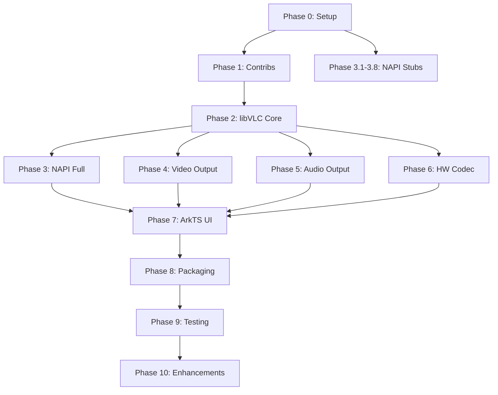

# VLC → OpenHarmony: Atomic Implementation Plan

> [!NOTE]
> This plan is derived from the research document [Porting_VLC_to_OpenHarmony_research.md](file:///home/francesco/Desktop/vlc_ohos/docs/Porting_VLC_to_OpenHarmony_research.md). Each step is designed to be independently actionable, testable, and mergeable. Steps within a phase are sequential unless noted otherwise.

---

## Phase 0 — Project Scaffold & Environment Setup

### 0.1 Install OpenHarmony SDK 
- [X] Download and install the latest OpenHarmony SDK (API 20).
- [X] Verify the SDK path: confirm `$(SDK_ROOT)/native/sysroot` exists and contains musl libc headers.
- [X] Verify the LLVM toolchain is at `$(SDK_ROOT)/native/llvm/bin/clang`.
- [X] Verify `ohos.toolchain.cmake` exists at `$(SDK_ROOT)/native/build/cmake/ohos.toolchain.cmake`.
- **Test:** Run `$(SDK_ROOT)/native/llvm/bin/clang --version` — must report `aarch64-linux-ohos` target support.

> SDK_ROOT in this setup is located at `/home/francesco/setup-ohos-sdk/linux/20`.
>
> Verification output:
> ```bash
> ❯ ${SDK_ROOT}/native/llvm/bin/clang --version
> OHOS (dev) clang version 15.0.4 (llvm-project bb5cdf0f93bfb5316dd3cc2a80d12ab829e49b43)
> Target: x86_64-unknown-linux-gnu
> Thread model: posix
> InstalledDir: /home/francesco/setup-ohos-sdk/linux/20/native/llvm/bin
> ```

### 0.2 Create the OpenHarmony Application Shell
- [X] Create a new OpenHarmony Stage Model project in DevEco Studio (HAP project).
- [X] Set `targetSdkVersion` and `compileSdkVersion` to the latest available in `build-profile.json5`.
- [X] Confirm the project compiles and deploys an empty "Hello World" ArkTS page to a device or emulator.
- **Test:** The empty app installs and displays on-screen.

### 0.3 Initialize the `vlc_ohos` Repository Structure
- [/] Create the following directory layout inside the project:
  ```
  vlc_ohos/
  ├── entry/                         # Main HAP module
  │   ├── src/main/
  │   │   ├── ets/                   # ArkTS UI code
  │   │   ├── cpp/                   # Native C/C++ code (NAPI bindings)
  │   │   │   └── CMakeLists.txt     # Native CMake build
  │   │   └── resources/
  │   ├── oh-package.json5
  │   └── build-profile.json5
  ├── vlccontrib/                    # Third-party contrib build scripts
  ├── libvlc/                        # libVLC source (git submodule)
  ├── modules/                       # Custom OpenHarmony VLC modules
  │   ├── codec/                     # OH_AVCodec decoder plugins
  │   ├── video_output/              # XComponent vout plugin
  │   └── audio_output/              # OHAudio aout plugin
  ├── napi/                          # NAPI binding layer
  ├── scripts/                       # Build/toolchain orchestration scripts
  └── docs/
  ```
- [X] Add VLC source as a git submodule: `git submodule add https://code.videolan.org/videolan/vlc.git libvlc`.
- [X] Check out latest stable branch: tag `3.0.23-2`.
- **Test:** `ls libvlc/include/vlc/libvlc.h` succeeds.

### 0.4 Create the Master Build Script Skeleton
- [X] Create `scripts/build_ohos.sh` with the following exported environment variables:
  ```bash
  export OHOS_SDK_ROOT="/path/to/OpenHarmony/Sdk"
  export OHOS_NDK="${OHOS_SDK_ROOT}/native"
  export OHOS_SYSROOT="${OHOS_NDK}/sysroot"
  export OHOS_TOOLCHAIN="${OHOS_NDK}/build/cmake/ohos.toolchain.cmake"
  export TARGET_ARCH="aarch64-linux-ohos"
  export CC="${OHOS_NDK}/llvm/bin/clang --target=${TARGET_ARCH}"
  export CXX="${OHOS_NDK}/llvm/bin/clang++ --target=${TARGET_ARCH}"
  export AR="${OHOS_NDK}/llvm/bin/llvm-ar"
  export NM="${OHOS_NDK}/llvm/bin/llvm-nm"
  export RANLIB="${OHOS_NDK}/llvm/bin/llvm-ranlib"
  export STRIP="${OHOS_NDK}/llvm/bin/llvm-strip"
  export CFLAGS="--sysroot=${OHOS_SYSROOT} -fPIC -Wl,-z,max-page-size=16384"
  export LDFLAGS="--sysroot=${OHOS_SYSROOT} -Wl,-z,max-page-size=16384"
  ```
- [X] Add a `--help` usage message and argument parsing.
- **Test:** `bash scripts/build_ohos.sh --help` prints usage without errors.

---

## Phase 1 — Cross-Compile Third-Party Dependencies (Contrib System)

### 1.1 Audit VLC Contrib Dependencies
- [x] Run `ls libvlc/contrib/src/` to enumerate all third-party libraries.
- [x] Create a spreadsheet/checklist of every contrib library with columns: `Name`, `Build System (autotools/cmake/meson)`, `Priority (critical/optional)`, `OHOS Status (not-started/building/passing)`.
- [x] Identify the **critical-path** libraries: `FFmpeg`, `libplacebo`, `libass`, `freetype`, `harfbuzz`, `fribidi`, `libbluray`, `libmad`, `flac`, `ogg`, `vorbis`, `opus`, `dav1d`, `x264`, `x265`, `gnutls` (or `mbedtls`).
- **Deliverable:** A markdown table of dependencies with priorities (see `vlc_contrib_audit.md`).

### 1.2 Prepare Contrib Build Environment
- [x] In `scripts/build_ohos.sh`, add a dedicated function `build_contribs()`.
- [x] Set `TARGET_TUPLE="aarch64-linux-ohos"`.
- [x] Create the contrib build directory: `mkdir -p libvlc/contrib/contrib-ohos-${TARGET_TUPLE}`.
- [x] In that directory, run `../bootstrap --host=${TARGET_TUPLE}...` (disable any problematic modules for now depending on findings in 1.1).
- [x] Write OpenHarmony toolchain paths to `config.mak` so VLC's contrib system can compile them natively (this mirrors the `vlc-android` port's approach):
  ```bash
  echo "EXTRA_CFLAGS=${CFLAGS}" >> config.mak
  echo "EXTRA_CXXFLAGS=${CXXFLAGS}" >> config.mak
  echo "EXTRA_LDFLAGS=${LDFLAGS}" >> config.mak
  echo "CC=${CC}" >> config.mak
  echo "CXX=${CXX}" >> config.mak
  echo "AR=${AR}" >> config.mak
  echo "AS=${CC} -c" >> config.mak
  echo "RANLIB=${RANLIB}" >> config.mak
  echo "LD=${LD}" >> config.mak
  echo "NM=${NM}" >> config.mak
  echo "STRIP=${STRIP}" >> config.mak
  ```
- **Test:** `cat libvlc/contrib/contrib-ohos-aarch64-linux-ohos/config.mak` shows correct paths and flags.

### 1.3 Fetch and Build Contribs
- [x] Inside `libvlc/contrib/contrib-ohos-${TARGET_TUPLE}`, run `make list` to verify recognized dependencies.
- [x] Run `make fetch` to download all third-party tarballs.
- [x] Run `make -j$(nproc)` to cross-compile all dependencies sequentially. *(Completed)*
> NOTE: This process will likely fail on several libraries since OpenHarmony is an unrecognized target or requires specific patches. We will need to patch individual `rules.mak` files in `libvlc/contrib/src/` for missing OS flags (e.g., adding OS-specific fixes or skipping unsupported features like Vulkan).
> 
> **Important Implementation Notes (Status):**
> * **config.sub OS recognition:** `config.sub` scripts did not recognize `linux-ohos*`. This was resolved by mutating the `UPDATE_AUTOCONFIG` and `RECONF` targets in `contrib/src/main.mak` to run a `sed` command that injects the required targets (`linux-ohos*` and `ohos*`).
> * **aribb24 config.sub parsing:** The `aribb24` module explicitly used its own `./bootstrap` script rather than `$(RECONF)`, bypassing our global `config.sub` `sed` patch. Replaced `./bootstrap` with `$(RECONF)` in `contrib/src/aribb24/rules.mak`.
> * **Broken diff tool:** OpenHarmony's toolchains include a customized `/home/francesco/command-line-tools/sdk/default/openharmony/toolchains/diff` that overrides standard GNU `diff`. The broken `diff` incorrectly exits with status `0` upon failure, causing Autotools `config.status` to wrongly assume header files (e.g., `jconfig.h` in `jpeg`) are identical to previous runs. This skipped generation of headers and broke builds. We fixed this by modifying `config.mak` to filter the OHOS toolchains directory out of `$PATH`.
> * **cddb missing AM_ICONV:** The `cddb` build failed on `autoreconf` with an undefined `AM_ICONV` macro error. `cddb` connects with audio CD databases and is completely irrelevant for modern OpenHarmony/mobile usage, so we completely disabled the dependency via `libvlc/contrib/src/cddb/rules.mak`.
> * **libgpg-error thread detection:** OpenHarmony lacks `pthread_cancel`. The `libgpg-error` build failed trying to use it for weak symbol thread detection. We patched `src/posix-lock.c` to assume pthreads are available unconditionally.
> * **libvpx configure errors:** The `libvpx` configure script failed doing compile-only feature tests because `-Wl,-z,max-page-size=16384` was passed in `CFLAGS` and triggered a warning treated as an error. Removed the linker flag from `CFLAGS` in `build_ohos.sh` and `config.mak`. Also patched `vpx/rules.mak` to not guess the cross compiler name (`VPX_CROSS`) on OpenHarmony, but strictly rely on `HOSTVARS` `CC`/`CXX`.
> * **Missing toolchain bins:** Scripts for `speex`, `x264` and `nfs` failed because `STRINGS`, `NM`, and `OBJDUMP` were missing from the environment. Added them to the `HOSTTOOLS` exported variables in `contrib/src/main.mak`.
> * **Disabled auxiliary packages:** `protobuf`, `lua`, `xcb` (X11 dependency), and `srt` (socket.h conflict) failed or are unnecessary, so they were added to `PKGS_DISABLE` in `config.mak`.
> * **sidplay2 narrowing error:** `sidplay2` failed due to a C++11 narrowing error. This was fixed by appending `CXXFLAGS="-Wno-c++11-narrowing"` to its configure parameters in `rules.mak`.
- **Test:** `make -j$(nproc)` eventually completes without errors, producing `.a` or `.so` files in `libvlc/contrib/aarch64-linux-ohos/lib/`.

### 1.4 Validate the Full Contrib Build
- [x] Run `ls libvlc/contrib/aarch64-linux-ohos/lib/*.a | wc -l` (VLC contribs are built statically by default).
- [x] Verify 16KB page alignment in `config.mak` LDFLAGS check.
- [x] Check that `libvlc/contrib/aarch64-linux-ohos` contains valid headers in `include/` and pkg-config files in `lib/pkgconfig/`.
- **Test:** `pkg-config --static --libs libavcodec` returns valid linker flags using the local contrib path.

---

## Phase 2 — Cross-Compile libVLC Core

### 2.1 Configure libVLC for OpenHarmony
- [x] Create `scripts/build_libvlc_ohos.sh`.
- [x] Navigate to `libvlc/` and run the bootstrap: `./bootstrap`.
- [x] Run `./configure` with:
  ```bash
  ./configure \
    --host=aarch64-linux-ohos \
    --prefix=${VLC_PREFIX} \
    --with-contrib=$(pwd)/contrib/aarch64-linux-ohos \
    --disable-a52 \
    --disable-xcb \
    --disable-qt \
    --disable-skins2 \
    --disable-vlc \
    --enable-nls=no \
    --disable-alsa \
    --disable-pulse \
    --disable-jack \
    --disable-sndio \
    --disable-wayland \
    --disable-v4l2 \
    --disable-lua
  ```
  > Note: OpenHarmony target detection is handled natively by `configure.ac` via the host triplet.
- [x] **Test:** `./configure` completes without fatal errors; `config.log` shows correct toolchain detection.

### 2.2 Patch VLC Autotools to Recognize `ohos` Target
- [x] Edit `libvlc/configure.ac`: add `linux-ohos*` case in the host-triplet switch.
- [x] Define `HAVE_OHOS` preprocessor macro when the target is detected.
- [x] Add `AM_CONDITIONAL(HAVE_OHOS, test "${HAVE_OHOS}" = "1")` to enable conditional compilation in `Makefile.am` files.
- [x] Regenerate build files: `autoreconf -ivf`.
- [x] **Test:** `./configure --host=aarch64-linux-ohos ...` sets `HAVE_OHOS=1`.

### 2.3 Compile libvlccore
- [x] Run `make -C libvlc/src -j$(nproc)`.
- [x] Verify: `file libvlc/src/.libs/libvlccore.so` → ARM aarch64.
- [x] Check symbol exports: `nm -D libvlc/src/.libs/libvlccore.so | grep vlc_object_create` — symbol present.
- **Test:** Library compiles without linker errors.
> **Important Implementation Notes (Status):**
> * **CC/CXX Environment Variables:** The `-target` and `--sysroot` flags were added directly to the `CC` and `CXX` variables in `scripts/build_ohos.sh` to prevent libtool from dropping linker flags.
> * **Missing POSIX functions in OpenHarmony musl libc:** Patched `libvlc/src/posix/filesystem.c` to bypass `posix_close`. Patched `libvlc/src/posix/thread.c` to stub out `pthread_cancel`, `pthread_setcancelstate`, and `pthread_testcancel` using `#ifndef __OHOS__` since thread cancellation is not supported on OpenHarmony.
> * **Dbus Linker Error:** Added `--disable-dbus` to `scripts/build_libvlc_ohos.sh` because DBus is not available on OpenHarmony.
> * **libcompat Dependency:** Had to run `make -C libvlc/compat` prior to compiling `libvlc/src` due to missing `libcompat.la` linking dependency.

### 2.4 Compile libvlc
- [x] Run `make -C libvlc/lib -j$(nproc)`.
- [x] Verify: `file libvlc/lib/.libs/libvlc.so` → ARM aarch64.
- [x] Check symbol exports: `nm -D libvlc/lib/.libs/libvlc.so | grep libvlc_new` — symbol present.
- **Test:** Library compiles without linker errors.

### 2.5 Compile VLC Built-in Plugins (Software Modules)
- [x] Run `make -C libvlc/modules -j$(nproc)`.
- [x] This compiles all platform-agnostic modules: demuxers (MKV, MP4, AVI, TS, FLV), software decoders (via FFmpeg), packetizers, stream filters, etc.
- [x] Verify: `ls libvlc/modules/.libs/*.so | head -20` — multiple `.so` files present.
- **Test:** No link errors against contrib libraries; `.so` files are ARM aarch64.
> **Important Implementation Notes:**
> * **Fortify Header Error:** OpenHarmony's `fortify.h` lacked the `O_TMPFILE` macro. Patched the NDK's sysroot explicitly.
> * **Pkg-Config Leaks:** Configured script modified to use strict `PKG_CONFIG_LIBDIR` and `pkg-config --static`.
> * **Thread Cancellation:** `shout` plugin disabled due to OpenHarmony missing `pthread_setcancelstate`.
> * **C++ Runtime Linking:** Added `-lc++_shared` to global `LDFLAGS` in `scripts/build_ohos.sh` to ensure static C++ contribs (x265, libgme, taglib, etc.) can link correctly without patching volatile `.pc` files.
> * **OpenGL Desktop Detection:** Forced `have_gl="no"` in `configure.ac` and disabled `--visual` plugins to avoid desktop OpenGL linkage errors.

### 2.6 Create the VLC Plugin Installation Bundle
- [x] Run `make install`.
- [x] Verify the following structure:
  ```
  ${VLC_INSTALL}/
  ├── lib/
  │   ├── libvlc.so
  │   ├── libvlccore.so
  │   └── vlc/
  │       └── plugins/
  │           ├── demux/
  │           ├── codec/
  │           ├── access/
  │           └── ...
  └── include/
      └── vlc/
  ```
- **Test:** `find ${VLC_INSTALL}/lib/vlc/plugins -name '*.so' | wc -l` returns > 100.
> **Important Implementation Notes (Status):**
> * **Installation Path:** `make install` correctly installed to the `--prefix` path configured in Step 2.1 (`vlc_install/`); `DESTDIR` was not needed.
> * **Missing AppData File:** `make install` failed initially because `org.videolan.vlc.appdata.xml` was missing in `libvlc/share` (caused by disabling GUI plugins). We fixed this by running `touch share/org.videolan.vlc.appdata.xml` before `make install`.

---

## Phase 3 — NAPI Binding Layer (JNI → Node-API)

### 3.1 Design the NAPI Interface Surface
- [ ] Create `napi/vlc_napi.h` — declare the C++ functions to be exported:
  ```cpp
  // Core lifecycle
  napi_value VlcNew(napi_env env, napi_callback_info info);
  napi_value VlcRelease(napi_env env, napi_callback_info info);

  // Media
  napi_value MediaNewPath(napi_env env, napi_callback_info info);
  napi_value MediaNewLocation(napi_env env, napi_callback_info info);
  napi_value MediaRelease(napi_env env, napi_callback_info info);

  // Media Player
  napi_value MediaPlayerNew(napi_env env, napi_callback_info info);
  napi_value MediaPlayerSetMedia(napi_env env, napi_callback_info info);
  napi_value MediaPlayerPlay(napi_env env, napi_callback_info info);
  napi_value MediaPlayerPause(napi_env env, napi_callback_info info);
  napi_value MediaPlayerStop(napi_env env, napi_callback_info info);
  napi_value MediaPlayerGetTime(napi_env env, napi_callback_info info);
  napi_value MediaPlayerSetTime(napi_env env, napi_callback_info info);
  napi_value MediaPlayerGetLength(napi_env env, napi_callback_info info);
  napi_value MediaPlayerGetPosition(napi_env env, napi_callback_info info);
  napi_value MediaPlayerSetPosition(napi_env env, napi_callback_info info);

  // Video output binding
  napi_value MediaPlayerSetNativeWindow(napi_env env, napi_callback_info info);

  // Events
  napi_value MediaPlayerAttachEvent(napi_env env, napi_callback_info info);
  napi_value MediaPlayerDetachEvent(napi_env env, napi_callback_info info);
  ```
- **Deliverable:** Header file with all function signatures.

### 3.2 Implement `libvlc_instance_t` Object Wrapping
- [ ] Create `napi/vlc_instance_wrap.cpp`.
- [ ] Implement `VlcNew`:
  - Call `napi_create_object` to instantiate an empty JS object to serve as the wrapper.
  - Parse `napi_value` arguments (VLC command-line args array).
  - Convert ArkTS string array → `const char* argv[]`.
  - Call `libvlc_new(argc, argv)`.
  - Use `napi_wrap(env, thisObj, instance, VlcInstanceFinalizer, nullptr, nullptr)` to bind the pointer (passing `nullptr` to the last argument creates a weak reference managed by GC).
- [ ] Implement `VlcInstanceFinalizer`:
  - Call `libvlc_release(instance)`.
- [ ] Implement `VlcRelease`:
  - Use `napi_remove_wrap(env, jsThis, &native_ptr)` to get the pointer AND detach the finalizer.
  - Safely call `libvlc_release(native_ptr)` only if `native_ptr` is not null (prevents double-free).
- **Test:** Instantiate from ArkTS — no crash; VlcRelease frees memory (verify with ASan).

### 3.3 Implement `libvlc_media_t` Object Wrapping
- [ ] Create `napi/vlc_media_wrap.cpp`.
- [ ] Implement `MediaNewPath`:
  - `napi_unwrap` the VLC instance from the first argument.
  - Parse the file path string from the second argument.
  - Call `libvlc_media_new_path(instance, path)`.
  - Wrap the result with `napi_wrap`.
- [ ] Implement `MediaNewLocation` (for network URLs).
- [ ] Implement `MediaRelease` with finalizer calling `libvlc_media_release`.
- **Test:** Create a media object from a local file path in ArkTS — no crash.

### 3.4 Implement `libvlc_media_player_t` Object Wrapping
- [ ] Create `napi/vlc_mediaplayer_wrap.cpp`.
- [ ] Implement `MediaPlayerNew`:
  - `napi_unwrap` the VLC instance.
  - Call `libvlc_media_player_new(instance)`.
  - Wrap the result.
- [ ] Implement `MediaPlayerSetMedia`:
  - `napi_unwrap` both the player and the media.
  - Call `libvlc_media_player_set_media(player, media)`.
- [ ] Implement `MediaPlayerPlay` / `Pause` / `Stop`:
  - `napi_unwrap` the player.
  - Call the corresponding `libvlc_media_player_*` function.
- **Test:** Create player → set media → play — VLC engine starts (visible in debug logs even without video/audio output yet).

### 3.5 Implement Time/Position Query Functions
- [ ] Implement `MediaPlayerGetTime`, `MediaPlayerSetTime`.
- [ ] Implement `MediaPlayerGetLength`.
- [ ] Implement `MediaPlayerGetPosition`, `MediaPlayerSetPosition`.
- [ ] Each function: `napi_unwrap` → call libvlc → `napi_create_int64` / `napi_create_double` → return.
- **Test:** While playing, call `GetTime` from ArkTS — returns a non-zero value.

### 3.6 Implement Thread-Safe Event Callbacks
- [ ] Create `napi/vlc_events.cpp`.
- [ ] Implement `MediaPlayerAttachEvent`:
  - Parse the event type (integer/enum) and the ArkTS callback function.
  - Use `napi_create_string_utf8` to create a resource name (`"VLCEvent"`).
  - Use `napi_create_threadsafe_function(env, callback, nullptr, resourceName, 0, 1, nullptr, nullptr, nullptr, VlcEventCallFromJS, &tsfn)` to create a thread-safe function handle. (The `tsfn` will internally hold a reference to the JS callback).
  - Call `libvlc_event_attach(event_manager, event_type, NativeEventCallback, tsfn).`
- [ ] Implement `NativeEventCallback` (C side, runs on VLC background thread):
  - Package the event data into a struct allocated on the heap.
  - Call `napi_call_threadsafe_function(tsfn, data, napi_tsfn_nonblocking)`.
- [ ] Implement `VlcEventCallFromJS` (C side, runs on main ArkTS thread):
  - **Important:** Wrap the entire function body in `napi_open_handle_scope` / `napi_close_handle_scope` to prevent memory leaks during high-frequency events (like `TimeChanged`).
  - Unpack the event data struct.
  - Create `napi_value` objects for event fields.
  - Invoke the stored ArkTS callback.
  - `delete` the unpacked event data struct.
- [ ] Implement `MediaPlayerDetachEvent`:
  - `libvlc_event_detach()`.
  - `napi_release_threadsafe_function(tsfn, napi_tsfn_release)`.
-  Handle the following events at minimum:
  - `libvlc_MediaPlayerPlaying`
  - `libvlc_MediaPlayerPaused`
  - `libvlc_MediaPlayerStopped`
  - `libvlc_MediaPlayerEndReached`
  - `libvlc_MediaPlayerTimeChanged`
  - `libvlc_MediaPlayerPositionChanged`
  - `libvlc_MediaPlayerBuffering`
  - `libvlc_MediaPlayerEncounteredError`
- **Test:** Attach a `TimeChanged` listener in ArkTS; play audio — ArkTS callback fires with incrementing time values.

### 3.7 Create the NAPI Module Registration
- [ ] Create `napi/vlc_napi_module.cpp`:
  ```cpp
  static napi_value Init(napi_env env, napi_value exports) {
      napi_property_descriptor desc[] = {
          {"vlcNew",                nullptr, VlcNew,                nullptr, nullptr, nullptr, napi_default, nullptr},
          {"vlcRelease",            nullptr, VlcRelease,            nullptr, nullptr, nullptr, napi_default, nullptr},
          {"mediaNewPath",          nullptr, MediaNewPath,          nullptr, nullptr, nullptr, napi_default, nullptr},
          {"mediaNewLocation",      nullptr, MediaNewLocation,      nullptr, nullptr, nullptr, napi_default, nullptr},
          {"mediaRelease",          nullptr, MediaRelease,          nullptr, nullptr, nullptr, napi_default, nullptr},
          {"mediaPlayerNew",        nullptr, MediaPlayerNew,        nullptr, nullptr, nullptr, napi_default, nullptr},
          {"mediaPlayerSetMedia",   nullptr, MediaPlayerSetMedia,   nullptr, nullptr, nullptr, napi_default, nullptr},
          {"mediaPlayerPlay",       nullptr, MediaPlayerPlay,       nullptr, nullptr, nullptr, napi_default, nullptr},
          {"mediaPlayerPause",      nullptr, MediaPlayerPause,      nullptr, nullptr, nullptr, napi_default, nullptr},
          {"mediaPlayerStop",       nullptr, MediaPlayerStop,       nullptr, nullptr, nullptr, napi_default, nullptr},
          {"mediaPlayerGetTime",    nullptr, MediaPlayerGetTime,    nullptr, nullptr, nullptr, napi_default, nullptr},
          {"mediaPlayerSetTime",    nullptr, MediaPlayerSetTime,    nullptr, nullptr, nullptr, napi_default, nullptr},
          {"mediaPlayerGetLength",  nullptr, MediaPlayerGetLength,  nullptr, nullptr, nullptr, napi_default, nullptr},
          {"mediaPlayerSetNativeWindow", nullptr, MediaPlayerSetNativeWindow, nullptr, nullptr, nullptr, napi_default, nullptr},
          {"mediaPlayerAttachEvent",    nullptr, MediaPlayerAttachEvent,    nullptr, nullptr, nullptr, napi_default, nullptr},
          {"mediaPlayerDetachEvent",    nullptr, MediaPlayerDetachEvent,    nullptr, nullptr, nullptr, napi_default, nullptr},
      };
      napi_define_properties(env, exports, sizeof(desc) / sizeof(desc[0]), desc);
      return exports;
  }
  EXTERN_C_START
  static napi_value RegisterModule(napi_env env, napi_value exports) { return Init(env, exports); }
  EXTERN_C_END
  static napi_module vlcModule = { .nm_version = 1, .nm_flags = 0, .nm_filename = nullptr,
      .nm_register_func = RegisterModule, .nm_modname = "vlcnative", .nm_priv = nullptr, .reserved = {0} };
  extern "C" __attribute__((constructor)) void RegisterVlcNativeModule(void) { napi_module_register(&vlcModule); }
  ```
- **Note:** Ensure `.nm_modname` exactly matches the project name in `CMakeLists.txt` (case-sensitive).
- **Test:** Module loads without crash when imported in ArkTS.

### 3.8 Write the TypeScript Declaration File (Native Module Structure)
- [ ] Create `entry/src/main/cpp/types/libvlcnative/index.d.ts`:
  ```typescript
  export interface VlcInstance {}
  export interface VlcMedia {}
  export interface VlcMediaPlayer {}

  export function vlcNew(args: string[]): VlcInstance;
  export function vlcRelease(instance: VlcInstance): void;

  export function mediaNewPath(instance: VlcInstance, path: string): VlcMedia;
  export function mediaNewLocation(instance: VlcInstance, url: string): VlcMedia;
  export function mediaRelease(media: VlcMedia): void;

  export function mediaPlayerNew(instance: VlcInstance): VlcMediaPlayer;
  export function mediaPlayerSetMedia(player: VlcMediaPlayer, media: VlcMedia): void;
  export function mediaPlayerPlay(player: VlcMediaPlayer): number;
  export function mediaPlayerPause(player: VlcMediaPlayer): void;
  export function mediaPlayerStop(player: VlcMediaPlayer): void;
  export function mediaPlayerGetTime(player: VlcMediaPlayer): number;
  export function mediaPlayerSetTime(player: VlcMediaPlayer, time: number): void;
  export function mediaPlayerGetLength(player: VlcMediaPlayer): number;
  export function mediaPlayerSetNativeWindow(player: VlcMediaPlayer, surfaceId: string): void;
  export function mediaPlayerAttachEvent(player: VlcMediaPlayer, eventType: number, callback: (event: any) => void): void;
  export function mediaPlayerDetachEvent(player: VlcMediaPlayer, eventType: number): void;
  ```
- [ ] Create `entry/src/main/cpp/types/libvlcnative/oh-package.json5`:
  ```json5
  {
    "name": "libvlcnative.so",
    "types": "./index.d.ts",
    "version": "1.0.0",
    "description": "VLC NAPI bindings"
  }
  ```
- **Test:** ArkTS code importing `libvlcnative.so` gets full IntelliSense / type-checking.

### 3.9 Set Up the Native CMakeLists.txt
- [ ] Create/update `entry/src/main/cpp/CMakeLists.txt`:
  ```cmake
  cmake_minimum_required(VERSION 3.16)
  project(vlcnative)

  set(VLC_INSTALL_DIR "${CMAKE_CURRENT_SOURCE_DIR}/../../../../vlc_install")
  set(CONTRIB_PREFIX  "${CMAKE_CURRENT_SOURCE_DIR}/../../../../contrib_prefix")

  add_library(vlcnative SHARED
      ${CMAKE_CURRENT_SOURCE_DIR}/../../../../napi/vlc_napi_module.cpp
      ${CMAKE_CURRENT_SOURCE_DIR}/../../../../napi/vlc_instance_wrap.cpp
      ${CMAKE_CURRENT_SOURCE_DIR}/../../../../napi/vlc_media_wrap.cpp
      ${CMAKE_CURRENT_SOURCE_DIR}/../../../../napi/vlc_mediaplayer_wrap.cpp
      ${CMAKE_CURRENT_SOURCE_DIR}/../../../../napi/vlc_events.cpp
  )

  target_include_directories(vlcnative PRIVATE
      ${VLC_INSTALL_DIR}/include
      ${CONTRIB_PREFIX}/include
  )

  target_link_directories(vlcnative PRIVATE
      ${VLC_INSTALL_DIR}/lib
      ${CONTRIB_PREFIX}/lib
  )

  target_link_libraries(vlcnative
      vlc
      vlccore
      libace_napi.z.so
      libhilog_ndk.z.so
  )
  ```
- [ ] Reference this `CMakeLists.txt` in `build-profile.json5` under `externalNativeOptions`.
- **Test:** `hvigor build` compiles `libvlcnative.so` without errors.

### 3.10 (Optional) Investigate SWIG for Automated Binding Generation
- [ ] Install SWIG with Node-API backend.
- [ ] Create a SWIG interface file `napi/vlc.i` covering `libvlc.h`, `libvlc_media.h`, and `libvlc_media_player.h`.
- [ ] Run `swig -javascript -napi -c++ -o napi/vlc_wrap.cpp napi/vlc.i`.
- [ ] Evaluate the generated code quality and compare against manual bindings.
- **Decision:** If SWIG output is clean and passes tests, adopt it to accelerate coverage of the remaining ~200 libVLC API functions.

---

## Phase 4 — Video Output (vout) Module: XComponent + OHNativeWindow

### 4.1 Create the XComponent ArkTS Declaration
- [ ] Create `entry/src/main/ets/pages/PlayerPage.ets`.
- [ ] Declare the XComponent with `type: 'surface'` (or `'texture'` for overlay controls):
  ```typescript
  @Entry
  @Component
  struct PlayerPage {
    private xComponentId: string = 'vlcXComponent';
    private xComponentController: XComponentController = new XComponentController();

    build() {
      Column() {
        XComponent({
          id: this.xComponentId,
          type: XComponentType.SURFACE,
          libraryname: 'vlcnative'
        })
        .onLoad(() => { /* native surface ready */ })
        .onDestroy(() => { /* cleanup */ })
        .width('100%')
        .aspectRatio(16/9)
      }
    }
  }
  ```
- **Test:** Page renders with XComponent placeholder visible.

### 4.2 Implement XComponent Native Lifecycle Callbacks
- [ ] Create `modules/video_output/ohos_vout.c` (or `.cpp`).
- [ ] Implement the registration function:
  ```cpp
  void OnSurfaceCreatedCB(OH_NativeXComponent* component, void* window) {
      OHNativeWindow* nativeWindow = static_cast<OHNativeWindow*>(window);
      // Store nativeWindow in a global or per-instance structure
      VlcOhosContext::getInstance()->setNativeWindow(nativeWindow);
  }

  void OnSurfaceChangedCB(OH_NativeXComponent* component, void* window) {
      // Handle resize: update width/height
  }

  void OnSurfaceDestroyedCB(OH_NativeXComponent* component, void* window) {
      VlcOhosContext::getInstance()->setNativeWindow(nullptr);
  }
  ```
- [ ] Register callbacks using `OH_NativeXComponent_RegisterCallback`.
- **Test:** Surface creation/destruction callbacks fire correctly (verify via log output).

### 4.3 Implement the VLC `vout` Display Module (Software Path)
- [ ] Create the VLC-style module boilerplate in `modules/video_output/ohos_vout.c`:
  ```c
  static int Open(vlc_object_t *obj);
  static void Close(vlc_object_t *obj);

  vlc_module_begin()
      set_shortname("OHOSVout")
      set_description("OpenHarmony Video Output")
      set_category(CAT_VIDEO)
      set_subcategory(SUBCAT_VIDEO_VOUT)
      set_capability("vout display", 260)
      set_callbacks(Open, Close)
  vlc_module_end()
  ```
- [ ] In `Open()`:
  - Allocate `vout_display_sys_t` struct.
  - Retrieve the `OHNativeWindow*` from `VlcOhosContext`.
  - Set `vd->fmt` to negotiate the display format (e.g., `VLC_CODEC_RGB32` or `VLC_CODEC_NV12`).
- [ ] In `Display()` callback:
  - Request an `OHNativeWindowBuffer` via `OH_NativeWindow_NativeWindowRequestBuffer`.
  - Map the buffer: `mmap()` on the buffer FD.
  - Copy the decoded frame's pixel data (from `picture_t`) into the mapped memory.
  - Unmap and flush: `OH_NativeWindow_NativeWindowFlushBuffer(window, buffer, fenceFd)`.
  - Use `poll()` on `fenceFd` to wait for the compositor to consume the buffer.
- **Test:** Play a software-decoded video — frames appear on the XComponent surface (even if slow).

### 4.4 Implement EGL Hardware Rendering Path
- [ ] In `Open()`, after acquiring `OHNativeWindow*`:
  - Initialize EGL: `eglGetDisplay(EGL_DEFAULT_DISPLAY)`, `eglInitialize()`.
  - Choose an EGL config supporting `EGL_OPENGL_ES2_BIT`.
  - Create EGL context: `eglCreateContext()`.
  - Create EGL surface: `eglCreateWindowSurface(display, config, nativeWindow, NULL)`.
  - Make current: `eglMakeCurrent()`.
- [ ] Use VLC's existing OpenGL/GLES rendering shaders (from `modules/video_output/opengl/`) to render `picture_t` textures.
- [ ] In `Display()`:
  - Upload the decoded frame to a GL texture.
  - Render the quad.
  - `eglSwapBuffers()`.
- **Test:** Play an H.264 video — smooth rendering with proper colors via GL shaders.

### 4.5 Implement Scaling Mode Mapping
- [ ] Map VLC aspect ratio settings to OpenHarmony scaling modes:
  ```c
  switch (vlc_aspect_mode) {
      case VLC_VOUT_CROP:
          OH_NativeWindow_NativeWindowHandleOpt(window, SET_SCALING_MODE, OH_SCALING_MODE_SCALE_CROP_V2);
          break;
      case VLC_VOUT_FIT:
          OH_NativeWindow_NativeWindowHandleOpt(window, SET_SCALING_MODE, OH_SCALING_MODE_SCALE_FIT_V2);
          break;
      case VLC_VOUT_STRETCH:
          OH_NativeWindow_NativeWindowHandleOpt(window, SET_SCALING_MODE, OH_SCALING_MODE_SCALE_TO_WINDOW_V2);
          break;
  }
  ```
- **Test:** Toggle aspect ratio in the UI — video display adjusts accordingly.

### 4.6 Handle Surface Lifecycle Events
- [ ] In `OnSurfaceDestroyedCB`: set a flag to pause the VLC video output pipeline.
- [ ] In `OnSurfaceCreatedCB` (when returning from background): re-acquire the window and re-initialize GL context.
- [ ] Handle `OnSurfaceChangedCB`: update `vd->cfg->display.width / height` and force VLC to re-negotiate the output format.
- **Test:** Rotate device / minimize and restore app — video output resumes without crash.

---

## Phase 5 — Audio Output (aout) Module: OHAudio

### 5.1 Create the VLC `aout` Module Boilerplate
- [ ] Create `modules/audio_output/ohos_aout.c`:
  ```c
  static int Open(vlc_object_t *obj);
  static void Close(vlc_object_t *obj);

  vlc_module_begin()
      set_shortname("OHOSAout")
      set_description("OpenHarmony Audio Output")
      set_category(CAT_AUDIO)
      set_subcategory(SUBCAT_AUDIO_AOUT)
      set_capability("audio output", 200)
      set_callbacks(Open, Close)
  vlc_module_end()
  ```
- **Deliverable:** Module file with VLC module registration.

### 5.2 Implement OHAudio Stream Builder Initialization
- [ ] In `Open()`:
  ```c
  OH_AudioStreamBuilder* builder;
  OH_AudioStreamBuilder_Create(&builder, AUDIOSTREAM_TYPE_RENDERER);

  // Map VLC audio format → OHAudio parameters
  OH_AudioStreamBuilder_SetSamplingRate(builder, aout->format.i_rate);
  OH_AudioStreamBuilder_SetChannelCount(builder, aout->format.i_channels);

  // Map VLC sample format → OHAudio sample format
  if (aout->format.i_format == VLC_CODEC_S16N)
      OH_AudioStreamBuilder_SetSampleFormat(builder, AUDIOSTREAM_SAMPLE_S16LE);
  else if (aout->format.i_format == VLC_CODEC_FL32)
      OH_AudioStreamBuilder_SetSampleFormat(builder, AUDIOSTREAM_SAMPLE_F32LE);

  // Set audio usage to MUSIC for proper OS routing
  OH_AudioStreamBuilder_SetRendererInfo(builder, AUDIOSTREAM_USAGE_MUSIC);
  ```
- **Test:** Builder creation succeeds (no `OH_AudioStream_Result` error).

### 5.3 Implement the Asynchronous Write Callback
- [ ] Define the callback structure:
  ```c
  static int32_t OnWriteData(OH_AudioRenderer* renderer,
                              void* userData,
                              void* buffer,
                              int32_t bufferLen) {
      audio_output_t *aout = (audio_output_t*)userData;
      // Pull PCM data from VLC's internal audio FIFO
      block_t *block = aout_FifoPop(aout, bufferLen);
      if (block) {
          memcpy(buffer, block->p_buffer, MIN(bufferLen, block->i_buffer));
          block_Release(block);
      } else {
          // Underrun: fill with silence
          memset(buffer, 0, bufferLen);
      }
      return 0;
  }
  ```
- [ ] Register the callback:
  ```c
  OH_AudioRenderer_Callbacks callbacks = { .OH_AudioRenderer_OnWriteData = OnWriteData };
  OH_AudioStreamBuilder_SetRendererCallback(builder, callbacks, aout);
  ```
- **Test:** Audio callback fires when renderer is started (verify via counter/log).

### 5.4 Generate the Renderer and Implement Lifecycle
- [ ] Generate the renderer:
  ```c
  OH_AudioRenderer* renderer;
  OH_AudioStreamBuilder_GenerateRenderer(builder, &renderer);
  OH_AudioStreamBuilder_Destroy(builder);  // builder no longer needed
  ```
- [ ] Store `renderer` in `aout->sys`.
- [ ] Implement VLC `aout` ops:
  - `Start()`: `OH_AudioRenderer_Start(sys->renderer);`
  - `Stop()`: `OH_AudioRenderer_Stop(sys->renderer);`
  - `Pause()`: `OH_AudioRenderer_Pause(sys->renderer);`
  - `Flush()`: `OH_AudioRenderer_Flush(sys->renderer);`
  - `VolumeSet()`: `OH_AudioRenderer_SetVolume(sys->renderer, volume);`
- [ ] In `Close()`: `OH_AudioRenderer_Release(sys->renderer);`
- **Test:** Play an audio-only file — sound comes from device speakers.

### 5.5 Implement Audio Interrupt Handling
- [ ] Register an interrupt listener to handle incoming calls/alarms:
  ```c
  static void OnInterrupt(OH_AudioRenderer* renderer,
                           void* userData,
                           OH_AudioInterrupt_ForceType forceType,
                           OH_AudioInterrupt_Hint hint) {
      audio_output_t *aout = (audio_output_t*)userData;
      switch(hint) {
          case AUDIOSTREAM_INTERRUPT_HINT_PAUSE:
              OH_AudioRenderer_Pause(renderer);
              // Notify VLC core of forced pause
              break;
          case AUDIOSTREAM_INTERRUPT_HINT_RESUME:
              OH_AudioRenderer_Start(renderer);
              break;
          case AUDIOSTREAM_INTERRUPT_HINT_STOP:
              OH_AudioRenderer_Stop(renderer);
              break;
      }
  }
  ```
- [ ] Register: `OH_AudioStreamBuilder_SetRendererInterruptCallback(builder, OnInterrupt, aout);`
- **Test:** Play audio → trigger an alarm → audio pauses → dismiss alarm → audio resumes.

### 5.6 Implement Dynamic Audio Format Re-Negotiation
- [ ] Handle cases where VLC's decoder outputs a format that changes mid-stream:
  - Detect format change in VLC core callback.
  - Stop and release the current renderer.
  - Re-create with new sample rate / channel count / format.
  - Start the new renderer.
- **Test:** Play a file that switches from stereo to 5.1 mid-stream — no crash, audio continues.

---

## Phase 6 — Hardware-Accelerated Decoding: OH_AVCodec

### 6.1 Create the Hardware Video Decoder Module
- [ ] Create `modules/codec/ohos_avcodec.c`.
- [ ] Register as a VLC decoder module:
  ```c
  vlc_module_begin()
      set_shortname("OHOSCodec")
      set_description("OpenHarmony HW Video Decoder")
      set_capability("video decoder", 800)  // High priority over software fallback
      set_callbacks(OpenDecoder, CloseDecoder)
  vlc_module_end()
  ```

### 6.2 Implement Codec Capability Querying
- [ ] In `OpenDecoder()`:
  ```c
  const char* mime = NULL;
  switch(dec->fmt_in.i_codec) {
      case VLC_CODEC_H264: mime = OH_AVCODEC_MIMETYPE_VIDEO_AVC; break;
      case VLC_CODEC_HEVC: mime = OH_AVCODEC_MIMETYPE_VIDEO_HEVC; break;
      case VLC_CODEC_AV1:  mime = OH_AVCODEC_MIMETYPE_VIDEO_AV1; break;
      case VLC_CODEC_VP9:  mime = OH_AVCODEC_MIMETYPE_VIDEO_VP9; break;
      default: return VLC_EGENERIC;  // Unsupported — fall back to software
  }

  OH_AVCapability* capability = OH_AVCodec_GetCapabilityByCategory(mime, false, HARDWARE);
  if (!capability) return VLC_EGENERIC;  // No HW support — fall back
  ```
- **Test:** Returns `VLC_SUCCESS` for H.264 on a real device, `VLC_EGENERIC` on unsupported codec.

### 6.3 Instantiate and Configure the Hardware Decoder
- [ ] Create the decoder instance:
  ```c
  OH_AVCodec* codec = OH_VideoDecoder_CreateByMime(mime);
  ```
- [ ] Configure using `OH_AVFormat`:
  ```c
  OH_AVFormat* format = OH_AVFormat_Create();
  OH_AVFormat_SetIntValue(format, OH_MD_KEY_WIDTH, dec->fmt_in.video.i_width);
  OH_AVFormat_SetIntValue(format, OH_MD_KEY_HEIGHT, dec->fmt_in.video.i_height);
  OH_AVFormat_SetIntValue(format, OH_MD_KEY_PIXEL_FORMAT, AV_PIXEL_FORMAT_NV12);

  // If extra data (SPS/PPS) is present, set it
  if (dec->fmt_in.i_extra > 0) {
      OH_AVFormat_SetBuffer(format, OH_MD_KEY_CODEC_CONFIG,
                            dec->fmt_in.p_extra, dec->fmt_in.i_extra);
  }

  OH_VideoDecoder_Configure(codec, format);
  OH_AVFormat_Destroy(format);
  ```
- **Test:** Configure succeeds without error return.

### 6.4 Register Asynchronous Decoder Callbacks
- [ ] Define the callback set:
  ```c
  static void OnError(OH_AVCodec* codec, int32_t errorCode, void* userData) {
      msg_Err(dec, "OH_AVCodec error: %d", errorCode);
  }

  static void OnStreamChanged(OH_AVCodec* codec, OH_AVFormat* format, void* userData) {
      // Re-read width/height/pixel format from the new format
  }

  static void OnNeedInputData(OH_AVCodec* codec, uint32_t index, OH_AVMemory* data, void* userData) {
      // Signal VLC that the decoder is ready for more input
      decoder_sys_t* sys = (decoder_sys_t*)userData;
      // Push index to an input buffer queue
  }

  static void OnNewOutputData(OH_AVCodec* codec, uint32_t index,
                               OH_AVMemory* data, OH_AVCodecBufferAttr* attr, void* userData) {
      // Signal VLC that a decoded frame is ready
      decoder_sys_t* sys = (decoder_sys_t*)userData;
      // Push index/data to an output buffer queue
  }
  ```
- [ ] Register:
  ```c
  OH_AVCodecAsyncCallback cb = {
      .onError = OnError,
      .onStreamChanged = OnStreamChanged,
      .onNeedInputData = OnNeedInputData,
      .onNewOutputData = OnNewOutputData,
  };
  OH_VideoDecoder_SetCallback(codec, cb, sys);
  ```

### 6.5 Implement the Decode Loop (Input Side)
- [ ] Start the decoder: `OH_VideoDecoder_Start(codec)`.
- [ ] In VLC's `Decode()` callback (called by VLC core with compressed `block_t`):
  - Wait for an input buffer index from `OnNeedInputData` (use a semaphore/condition variable).
  - Get the buffer address: `uint8_t* buf = OH_AVMemory_GetAddr(data)`.
  - Copy the compressed NAL units from `block->p_buffer` into `buf`.
  - Set buffer attributes (size, timestamp, flags).
  - Submit: `OH_VideoDecoder_PushInputData(codec, index, attr)`.
- **Test:** Input data flows into the decoder without stalls (verify via `OnNeedInputData` call frequency).

### 6.6 Implement the Decode Loop (Output Side)
- [ ] In `OnNewOutputData`:
  - If in **surface mode** (zero-copy rendering to XComponent):
    ```c
    OH_VideoDecoder_RenderOutputData(codec, index);  // Frame goes directly to display
    ```
  - If in **buffer mode** (software post-processing needed):
    - Read pixels from `OH_AVMemory_GetAddr(data)`.
    - Create a VLC `picture_t` and copy the data.
    - Pass to VLC's `decoder_QueueVideo()`.
    - Free: `OH_VideoDecoder_FreeOutputData(codec, index)`.
- **Test:** Video frames appear on screen via the hardware path.

### 6.7 Configure Surface Mode for Zero-Copy Rendering
- [ ] Link the decoder directly to the `OHNativeWindow*` from the XComponent:
  ```c
  OH_VideoDecoder_SetSurface(codec, VlcOhosContext::getInstance()->getNativeWindow());
  ```
  > This must be called **before** `OH_VideoDecoder_Start`.
- [ ] When `OnNewOutputData` fires, call `OH_VideoDecoder_RenderOutputData(codec, index)` to composite the frame directly.
- **Test:** Play a 1080p H.264 file — CPU usage is minimal compared to software decode path.

### 6.8 Implement Decoder Cleanup and Error Recovery
- [ ] In `CloseDecoder()`:
  ```c
  OH_VideoDecoder_Stop(codec);
  OH_VideoDecoder_Destroy(codec);
  ```
- [ ] Handle `OnError` callback: log the error, signal VLC to switch to software fallback.
- [ ] Handle codec reconfiguration on stream format changes (`OnStreamChanged`).
- **Test:** Trigger an error condition (e.g., malformed stream) — VLC falls back to software decode gracefully.

### 6.9 (Optional) Implement Hardware Audio Decoding
- [ ] Create `modules/codec/ohos_audio_avcodec.c`.
- [ ] Follow the same pattern as video, using `OH_AudioCodec_CreateByMime`.
- [ ] Support AAC, FLAC, MP3 at minimum.
- [ ] Decoded PCM goes to the `aout` module from Phase 5.
- **Test:** Play an AAC file with HW audio decoding — lower CPU usage than software path.

---

## Phase 7 — ArkTS UI and Application Integration

### 7.1 Create the VLC Service Wrapper in ArkTS
- [ ] Create `entry/src/main/ets/services/VlcService.ets`:
  ```typescript
  import vlcnative from 'libvlcnative.so';

  export class VlcService {
    private instance: any;
    private player: any;

    constructor() {
      this.instance = vlcnative.vlcNew(['--no-xlib', '-vvv']);
    }

    loadMedia(path: string): void {
      const media = vlcnative.mediaNewPath(this.instance, path);
      this.player = vlcnative.mediaPlayerNew(this.instance);
      vlcnative.mediaPlayerSetMedia(this.player, media);
      vlcnative.mediaRelease(media);
    }

    play(): void { vlcnative.mediaPlayerPlay(this.player); }
    pause(): void { vlcnative.mediaPlayerPause(this.player); }
    stop(): void { vlcnative.mediaPlayerStop(this.player); }
    getTime(): number { return vlcnative.mediaPlayerGetTime(this.player); }
    getLength(): number { return vlcnative.mediaPlayerGetLength(this.player); }
    seekTo(ms: number): void { vlcnative.mediaPlayerSetTime(this.player, ms); }

    onEvent(eventType: number, callback: (event: any) => void): void {
      vlcnative.mediaPlayerAttachEvent(this.player, eventType, callback);
    }

    destroy(): void {
      vlcnative.mediaPlayerStop(this.player);
      vlcnative.vlcRelease(this.instance);
    }
  }
  ```
- **Test:** Import and instantiate `VlcService` — no crash.

### 7.2 Build the Player UI Page
- [ ] Update `PlayerPage.ets` with playback controls:
  - Play/Pause button.
  - Seek slider (driven by `TimeChanged` events).
  - Time display (current / total).
  - Volume slider.
  - Aspect ratio toggle button.
- [ ] Wire controls to `VlcService` methods.
- **Test:** UI renders all controls; tapping Play starts playback.

### 7.3 Implement File Picker Integration
- [ ] Use OpenHarmony's `DocumentViewPicker` or `FilePicker` to let users select media files.
- [ ] Pass the selected file URI to `VlcService.loadMedia()`.
- **Test:** Select a local MP4 file via picker — playback begins.

### 7.4 Implement Network Stream Support
- [ ] Add a URL input dialog.
- [ ] Use `mediaNewLocation` for network URLs (HTTP, RTSP, HLS).
- [ ] Declare `ohos.permission.INTERNET` in `module.json5`.
- **Test:** Enter an HLS URL — streaming playback works.

### 7.5 Handle Application Lifecycle
- [ ] In the page's `aboutToDisappear()`:
  - Pause playback.
  - Release resources via `VlcService.destroy()`.
- [ ] In the Ability's `onBackground()`:
  - Continue audio-only playback (if implementing background audio).
  - OR pause all playback.
- [ ] In the Ability's `onForeground()`:
  - Re-acquire XComponent surface.
  - Resume playback.
- **Test:** Switch to another app and back — VLC recovers gracefully.

---

## Phase 8 — Permissions, Packaging & Signing

### 8.1 Declare Required Permissions
- [ ] Edit `entry/src/main/module.json5`:
  ```json5
  {
    "requestPermissions": [
      { "name": "ohos.permission.INTERNET" },
      { "name": "ohos.permission.READ_MEDIA" },
      { "name": "ohos.permission.MICROPHONE" }  // Only if recording features are included
    ]
  }
  ```
- **Test:** Permissions appear in the app's settings page after install.

### 8.2 Configure the Build Profile
- [ ] Edit `build-profile.json5`:
  - Set `compileSdkVersion` and `compatibleSdkVersion`.
  - Configure `externalNativeOptions`:
    ```json5
    {
      "path": "./entry/src/main/cpp/CMakeLists.txt",
      "arguments": "-DOHOS_ARCH=arm64-v8a",
      "cppFlags": ""
    }
    ```
- **Test:** `hvigor build` succeeds.

### 8.3 Bundle Native Libraries into the HAP
- [ ] Ensure all `.so` files are placed in `entry/libs/arm64-v8a/`:
  - `libvlcnative.so` (NAPI binding)
  - `libvlc.so`, `libvlccore.so`
  - All VLC plugin `.so` files (place in a `plugins/` subdirectory or embed via VLC's `--with-plugin-path`)
  - All contrib `.so` files (`libavcodec.so`, `libavformat.so`, etc.)
- [ ] Verify: the HAP's `libs/` directory structure is correct and all `.so` files are ARM aarch64.
- **Test:** `hvigor assembleHap` produces a `.hap` file; `unzip -l *.hap | grep .so` lists all expected libraries.

### 8.4 Configure VLC Plugin Discovery
- [ ] Set the VLC plugin path at runtime (in `VlcNew` arguments):
  ```
  '--plugin-path=/data/storage/el1/bundle/libs/arm64'
  ```
  Or use `libvlc_set_plugin_path()` before initializing.
- [ ] Ensure VLC can discover and load plugins from the HAP's extracted library directory.
- **Test:** VLC logs show "module loaded" messages for codecs and output modules.

### 8.5 Sign the Application
- [ ] For **development**: use DevEco Studio's automatic debug signing.
- [ ] For **release**: generate a signing key and configure `Hapsigner`.
- [ ] Build the signed HAP: `hvigor assembleHap --mode release`.
- **Test:** The signed HAP installs on a real HarmonyOS NEXT device.

---

## Phase 9 — Testing & Verification

### 9.1 Functional Test Matrix

| # | Test Case | Input | Expected Result |
|:-:|:----------|:------|:----------------|
| 1 | Local MP4 (H.264+AAC) | `test.mp4` | Video + audio playback, HW decode |
| 2 | Local MKV (HEVC+FLAC) | `test.mkv` | Video + audio, subtitle rendering |
| 3 | Local AVI (MPEG4+MP3) | `test.avi` | Software decode fallback |
| 4 | HLS Stream | URL | Adaptive bitrate streaming |
| 5 | RTSP Stream | URL | Low-latency live playback |
| 6 | Corrupt file | `broken.mp4` | Graceful error, no crash |
| 7 | Large file (4K HDR) | `4k_hdr.mkv` | HW decode, smooth playback |
| 8 | Audio-only (FLAC) | `music.flac` | Audio plays, no video surface |
| 9 | Seek operations | Any file | Accurate seeking, no freeze |
| 10 | Pause/Resume | Any file | Instant pause/resume |
| 11 | Background/Foreground | Any file | Graceful lifecycle handling |
| 12 | Audio interrupt (call) | During playback | Auto-pause, auto-resume |
| 13 | Aspect ratio toggle | Any video | Crop/Fit/Stretch modes work |
| 14 | Memory leak check | Long playback | No memory growth over 30 min |

### 9.2 Performance Benchmarks
- [ ] Measure CPU usage during 1080p H.264 HW decoding — target < 10%.
- [ ] Measure CPU usage during 1080p SW decoding — baseline measurement.
- [ ] Measure audio latency — target < 50ms.
- [ ] Measure seek latency — target < 500ms for local files.
- [ ] Verify 16KB page alignment on ALL `.so` files: `readelf -l *.so | grep 'LOAD.*0x4000'`.

### 9.3 Memory Safety Validation
- [ ] Run the application with AddressSanitizer (ASan) enabled.
- [ ] Fix any buffer overflows, use-after-free, or memory leaks detected.
- [ ] Verify NAPI reference counting: no leaked `napi_ref` or `napi_threadsafe_function` handles.
- **Test:** ASan-instrumented build passes all tests from 9.1 without sanitizer reports.

---

## Phase 10 — Optional Enhancements

### 10.1 Subtitle Rendering
- [ ] Ensure `libass` is linked and the VLC subtitle module is compiled.
- [ ] Overlay subtitles on the XComponent surface (via GL blending or a separate ArkUI text overlay).
- **Test:** Play an MKV with embedded subtitles — text displays correctly.

### 10.2 Background Audio Playback
- [ ] Implement an OpenHarmony `ServiceAbility` for background audio.
- [ ] Keep the VLC audio pipeline active when the app moves to background.
- [ ] Display a media notification with playback controls.
- **Test:** Play audio → switch apps → audio continues playing.

### 10.3 Media Session Integration
- [ ] Integrate with OpenHarmony's media session / now-playing APIs.
- [ ] Expose metadata (title, artist, album art) to the system.
- **Test:** Lock screen shows playback controls and metadata.

### 10.4 Chromecast / DLNA Support
- [ ] Evaluate VLC's existing renderer discovery modules.
- [ ] Adapt network discovery to work under OpenHarmony's network permissions model.

### 10.5 Picture-in-Picture (PiP)
- [ ] Investigate OpenHarmony's PiP window mode APIs.
- [ ] Resize XComponent into a floating PiP window.
- **Test:** Activate PiP — video continues in a small overlay.

---

## Dependency Graph (Execution Order)



> [!IMPORTANT]
> **Phases 4, 5, and 6 can be developed in parallel** once Phase 2 is complete. Each produces an independent VLC module (`.so`). Phase 7 is the integration point where all modules come together.

> [!TIP]
> Start with the **Audio Output module (Phase 5)** first — it's the simplest I/O boundary and provides quick smoke-test validation of the entire build pipeline (contribs → libVLC → NAPI → ArkTS → Audio).
